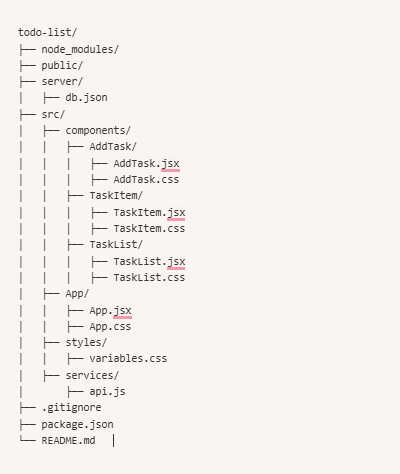
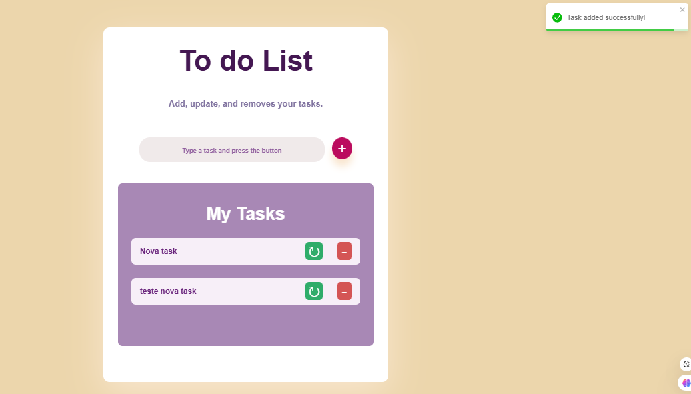
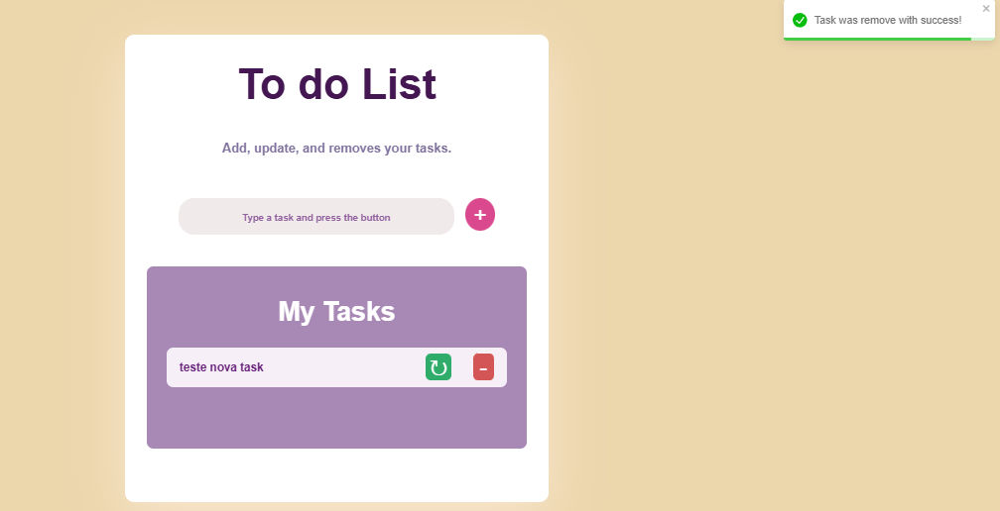
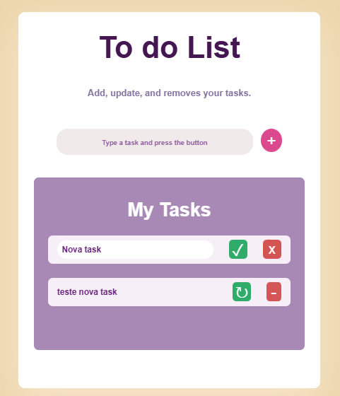
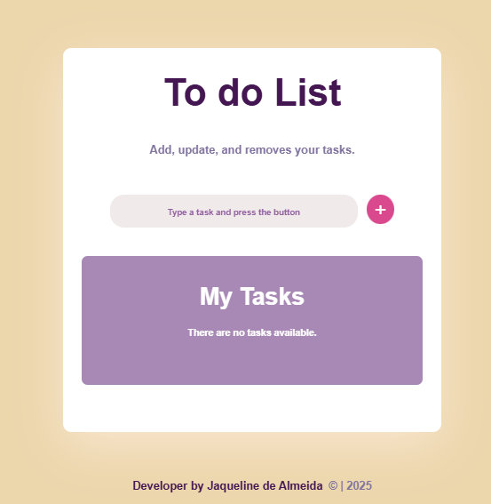

# To do List APP

Uma aplicação para criar, atualizar e remover tarefas. 

## Arquitetura do Projeto

Este projeto utiliza uma arquitetura de **SPA (Single Page Application)** com **cliente-servidor**. A aplicação foi criada em React para fornecer uma interface de usuário dinâmica e responsiva. As operações de CRUD (Create, Read, Update, Delete) são realizadas através de uma API REST, e os dados são armazenados em um mock de banco de dados utilizando `db.json`.

Esta arquitetura permite uma separação entre a lógica de apresentação (frontend) e a lógica de negócios (backend), facilitando a manutenção e escalabilidade do projeto.

## Stacks:

- **React**: Biblioteca JavaScript para construção da interface de usuário.
- **API REST**: Interface para comunicação entre o cliente e o servidor, permitindo operações de CRUD.
- **Mock de Banco de Dados (`db.json`)**: Utilizado para armazenar a lista de tarefas adicionadas.
- **Axios**: Biblioteca para fazer requisições HTTP para a API REST.
- **Toast**: Biblioteca para exibição de mensagens de sucesso, exclusão e erros.

## Estrutura

  

## Visualização da aplicação
 

 

 

 

 

## Deploy
O deploy em produção foi feito no Netlify.

## Scripts Disponíveis

#### `npm start`
Inicializa o app no modo desenvolvimento.  
Abra [http://localhost:3000](http://localhost:3000) para visualizar no navegador.

#### `npm run server`
Inicializa o servidor JSON na porta 5000.

#### `npm run build`
Cria a versão de produção da aplicação na pasta `build`.

#### `serve -s build`
Serve a aplicação a partir da pasta `build` utilizando o servidor estático.  

## Link da aplicação

https://app-my-tasks.netlify.app/

## Autores

- [@ojaqueline-de-almeida](https://github.com/jaquelinedealmeida)